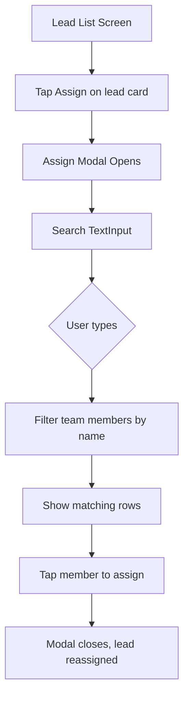

# Plan: Add Search to Assign Modal + Remove Inline Assign from Detail

## Context

Currently there are two ways to assign a lead:
1. **LeadListScreen**: Tap "Assign" on a lead card → opens a modal with a scrollable team list (no search)
2. **LeadDetailScreen**: Inline "Assign Lead" section with chip buttons (search was just added)

The user wants to:
- **Add a search field** inside the existing assign modal on [`LeadListScreen`](frontend/src/screens/LeadListScreen.tsx:411)
- **Remove** the inline "Assign Lead" section from [`LeadDetailScreen`](frontend/src/screens/LeadDetailScreen.tsx:1077)

---

## Changes Required

### 1. [`LeadListScreen.tsx`](frontend/src/screens/LeadListScreen.tsx) — Add search to assign modal

**1a. Add `assignSearch` state** (after line 111):
```tsx
const [assignSearch, setAssignSearch] = useState('');
```

**1b. Add `filteredAssignTargets` memo** (after `assignTargets`, ~line 329):
```tsx
const filteredAssignTargets = React.useMemo(() => {
  if (!assignSearch.trim()) return assignTargets;
  const q = assignSearch.toLowerCase();
  return assignTargets.filter((t: any) => t.name.toLowerCase().includes(q));
}, [assignTargets, assignSearch]);
```

**1c. Add search `TextInput` + use filtered list in modal** (replace lines 416-423):
```tsx
<Text style={styles.assignSubtitle}>{assignLead?.name ?? ''}</Text>
<TextInput
  value={assignSearch}
  onChangeText={setAssignSearch}
  placeholder="Search team members..."
  placeholderTextColor={Colors.textSecondary}
  style={styles.assignSearchInput}
/>
<ScrollView style={{ maxHeight: 360 }} showsVerticalScrollIndicator={false}>
  {filteredAssignTargets.length === 0 ? (
    <Text style={styles.assignEmptyText}>No team members found</Text>
  ) : (
    filteredAssignTargets.map((t: any) => (...))
  )}
</ScrollView>
```

**1d. Clear search on close** — update `closeAssign` to reset `assignSearch`:
```tsx
const closeAssign = () => {
  setAssignOpen(false);
  setAssignLead(null);
  setAssignSearch('');
};
```

**1e. Add styles**: `assignSearchInput` and `assignEmptyText`

---

### 2. [`LeadDetailScreen.tsx`](frontend/src/screens/LeadDetailScreen.tsx) — Remove inline assign section

**2a. Remove `assignSearch` state** (line 112)

**2b. Remove `filteredAssignableUsers` memo** (lines 174-178)

**2c. Remove the entire "Assign Lead" JSX block** (lines 1077-1100)

**2d. Remove unused styles**: `assignSearchInput` and `noResultsText`

**2e. Remove staff-related code** (since it was only used for assign):
- `staff` state (line 70)
- `fetchStaff` (lines 126-131)
- `assignableUsers` memo (lines 162-172)
- `isAssignedTo` function (lines 180-184)
- The `fetchStaff()` call in `useEffect` (line 149)
- Remove `Staff` from imports if no longer used elsewhere

Wait — check if `staff`/`assignableUsers`/`isAssignedTo`/`fetchStaff` are used elsewhere in the file before removing. If so, keep what's still needed.

## Flow



---

## Files Modified
1. [`LeadListScreen.tsx`](frontend/src/screens/LeadListScreen.tsx) — Add search to assign modal
2. [`LeadDetailScreen.tsx`](frontend/src/screens/LeadDetailScreen.tsx) — Remove inline assign section + revert earlier search changes