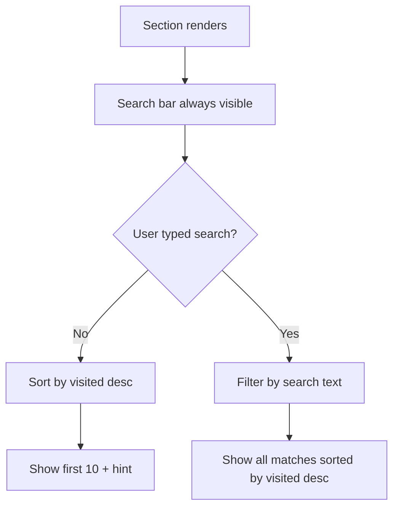

# Plan: Dashboard — Always Show Search + Cap at 10 + Sort by Visited

## Changes in [`DashboardScreen.tsx`](frontend/src/screens/DashboardScreen.tsx)

### 1. Team Performance (lines 493-522)

| # | Change | Location |
|---|--------|----------|
| 1a | Remove `{perUser.length > 3 && (...)}` guard — search always visible | Line 497 |
| 1b | Add `MAX_VISIBLE = 10` constant at top of component | ~Line 89 |
| 1c | Sort `perUser` by `total_visits` (desc) before filtering | Line 513 |
| 1d | When no search: `.slice(0, MAX_VISIBLE)` + "Showing 10 of X" hint | Line 513-515 |
| 1e | When searching: show all filtered results (no cap) | Line 513-515 |

### 2. Project Performance (lines 524-583)

| # | Change | Location |
|---|--------|----------|
| 2a | Remove `{projectStats.length > 3 && (...)}` guard — search always visible | Line 528 |
| 2b | Sort `projectStats` by `visited` (desc) before filtering | Line 544 |
| 2c | When no search: `.slice(0, MAX_VISIBLE)` + "Showing 10 of X" hint | Lines 544-576 |
| 2d | When searching: show all filtered results (no cap) | Lines 544-576 |

### 3. New style: `showingHint` — small gray text for the "Showing X of Y" message

## Flow

## Key Details

- **Sort order**: Both sections sorted by `visited` (or `total_visits` for team) descending — most active at top
- **Cap applies only when NOT searching** — searching shows all matching results
- **Hint text**: "Showing 10 of 45 projects. Use search to find more." (hidden when total ≤ 10)

## Files Modified

1. [`DashboardScreen.tsx`](frontend/src/screens/DashboardScreen.tsx) — All changes in one file