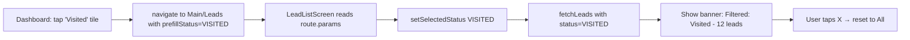

# Phase A — Tappable Dashboard Metrics → Filtered Lead List

## Overview
Make dashboard stat cards and pipeline tiles tappable. Tapping navigates to the Leads tab with the corresponding status pre-applied, so users can drill down from a metric to the actual leads behind it.

**Scope:** Status-mapped metrics only (no derived metrics like Total Visited, Revisited).

---

## Metric → Status Mapping

### Top Stat Cards (2 of 4 tappable)

| Card | Navigates to |
|------|-------------|
| Total Leads | Leads tab, no status filter (all leads) |
| Visit Booked | `VISIT_BOOKED` |
| ~~Total Visited~~ | Phase B (derived) |
| ~~Revisited~~ | Phase B (derived) |

### Pipeline Tiles (all 8 tappable)

| Tile | Navigates to |
|------|-------------|
| Callback | `CALLBACK` |
| Interested | `INTERESTED` |
| Visited | `VISITED` |
| Booked | `BOOKED` |
| Re-Visit Booked | `RE_VISIT` |
| Not Interested | `NOT_INTERESTED` |
| Invalid Number | `INVALID_NUMBER` |
| Today's Visits | `VISIT_BOOKED,RE_VISIT` (both visit statuses) |

---

## Todo List

1. **Add `statuses` query param to backend `getLeads`** — supports comma-separated multiple statuses for "Today's Visits" case
2. **Add `onPress` prop to `StatCard`** — make the top-level stat cards tappable
3. **Wrap pipeline tiles in `TouchableOpacity`** — make all 8 pipeline tiles tappable
4. **Wire navigation on dashboard** — `navigation.navigate('Main', { screen: 'Leads', params: { prefillStatus, prefillStatuses? } })` from each tappable metric
5. **Read `route.params` in `LeadListScreen`** — accept the prefill params and apply status filter on mount
6. **Add filter banner to `LeadListScreen`** — show "Filtered: Visited (N leads)" with a clear button when arriving from dashboard

---

## Architecture Flow



---

## Details Per File

### 1. [`backend/src/controllers/leadController.ts`](backend/src/controllers/leadController.ts) — `getLeads`

Add support for multiple statuses via `statuses` query param (comma-separated). If `statuses` is present, it takes precedence over `status`.

```typescript
// After line 303 (existing status filter):
if (req.query.statuses) {
  query.status = { $in: (req.query.statuses as string).split(',') };
} else if (status) {
  query.status = status;
}
```

### 2. [`frontend/src/screens/DashboardScreen.tsx`](frontend/src/screens/DashboardScreen.tsx:81) — `StatCard`

Add optional `onPress` prop. When provided, wrap in `TouchableOpacity`.

```typescript
const StatCard = ({ label, value, color, onPress }: { 
  label: string; value: number; color: string; onPress?: () => void 
}) => (
  <TouchableOpacity 
    style={styles.statCard} 
    onPress={onPress} 
    disabled={!onPress}
    activeOpacity={onPress ? 0.7 : 1}
  >
    <Text style={[styles.statValue, { color }]}>{value}</Text>
    <Text style={styles.statLabel}>{label}</Text>
  </TouchableOpacity>
);
```

### 3. [`frontend/src/screens/DashboardScreen.tsx`](frontend/src/screens/DashboardScreen.tsx:335) — Wire navigation

Define a helper:
```typescript
const navigateToLeads = (prefillStatus?: string, prefillStatuses?: string) => {
  navigation.navigate('Main', {
    screen: 'Leads',
    params: { prefillStatus, prefillStatuses },
  });
};
```

Wire each metric:
```tsx
// Top row
<StatCard label="Total Leads" value={stats.total} color={Colors.primary} 
  onPress={() => navigateToLeads()} />
<StatCard label="Visit Booked" value={stats.visit_booked} color="#06b6d4" 
  onPress={() => navigateToLeads('VISIT_BOOKED')} />

// Pipeline tiles — wrap each <View style={styles.pipelineStat}> in <TouchableOpacity>
// Callback
<TouchableOpacity onPress={() => navigateToLeads('CALLBACK')} activeOpacity={0.7}>
  <View style={[styles.pipelineStat, { borderLeftColor: '#3b82f6' }]}>
    ...
  </View>
</TouchableOpacity>
// ...repeat for all 8 tiles

// Today's Visits uses statuses for multi-status:
<TouchableOpacity onPress={() => navigateToLeads('VISIT_BOOKED', 'VISIT_BOOKED,RE_VISIT')} activeOpacity={0.7}>
```

### 4. [`frontend/src/screens/LeadListScreen.tsx`](frontend/src/screens/LeadListScreen.tsx:22) — Accept route params

- Add `route` to component destructuring: `({ navigation, route }: { navigation: any; route: any })`
- Add `prefillApplied` state to track whether a prefill has been consumed
- On mount/params change, read `route.params?.prefillStatus` and apply

```typescript
const [prefillApplied, setPrefillApplied] = useState(false);

// In useEffect, after existing fetches:
if (route.params?.prefillStatus && !prefillApplied) {
  setSelectedStatus(route.params.prefillStatus);
  setPrefillApplied(true);
}

// For statuses (Today's Visits): modify fetchLeads to support:
if (route.params?.prefillStatuses) {
  params.push(`statuses=${encodeURIComponent(route.params.prefillStatuses)}`);
}
```

### 5. [`frontend/src/screens/LeadListScreen.tsx`](frontend/src/screens/LeadListScreen.tsx) — Filter banner

When `prefillApplied` is true, show a banner above the header:

```tsx
{prefillApplied && (
  <View style={styles.filterBanner}>
    <Text style={styles.filterBannerText}>
      Filtered: {selectedStatus.replace(/_/g, ' ')} ({leads.length} leads)
    </Text>
    <TouchableOpacity onPress={() => {
      setSelectedStatus('All');
      setPrefillApplied(false);
      // Also clear route params
      navigation.setParams({ prefillStatus: undefined, prefillStatuses: undefined });
    }}>
      <Text style={styles.filterBannerClear}>✕ Clear</Text>
    </TouchableOpacity>
  </View>
)}
```

Style:
```typescript
filterBanner: {
  flexDirection: 'row',
  justifyContent: 'space-between',
  alignItems: 'center',
  backgroundColor: Colors.primary + '15',
  paddingHorizontal: 16,
  paddingVertical: 10,
  marginHorizontal: 24,
  marginTop: 12,
  borderRadius: 10,
},
filterBannerText: {
  color: Colors.primary,
  fontSize: 13,
  fontWeight: '700',
},
filterBannerClear: {
  color: Colors.primary,
  fontSize: 13,
  fontWeight: '800',
},
```

---

## Known Limitations (Phase B)

- **Total Visited** and **Revisited** stat cards won't be tappable yet — these need `has_visits` / `has_revisits` backend params
- **Week strip day cards** won't be tappable yet — these need `site_visit_date` backend param
- **Today's Visits** count on the tile may not exactly match the lead list count if leads have both `VISIT_BOOKED` and `RE_VISIT` simultaneously (edge case)