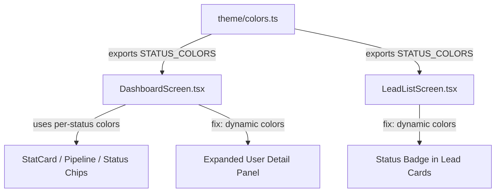

# Plan: Dynamic Status Colors for Revisited & Status Badges

## Problem Summary

Two areas in the app display white/gray colors where dynamic per-status colors (matching the Dashboard) should appear:

1. **DashboardScreen** — Expanded user detail panel: "Assigned", "Visited", "Revisited" values render as white (`Colors.text`) instead of indigo, teal, purple (which the collapsed row already uses).
2. **LeadListScreen** — Status badges in lead cards: All statuses render as gray (`Colors.textSecondary`) instead of using the per-status color map that Dashboard already defines.

## Root Cause

- [`frontend/src/screens/DashboardScreen.tsx`](frontend/src/screens/DashboardScreen.tsx:48) defines a `STATUS_COLORS` map locally at line 48, but it's not exported/shared.
- [`frontend/src/screens/LeadListScreen.tsx`](frontend/src/screens/LeadListScreen.tsx:498) has no status color map at all — the status badge uses `Colors.textSecondary` uniformly (line 499).
- [`frontend/src/screens/DashboardScreen.tsx`](frontend/src/screens/DashboardScreen.tsx:612) the expanded detail panel's `userSummaryValue` style uses `Colors.text` (white) for all three metrics, ignoring the distinct colors used in the collapsed row (line 242: `#0d9488`, line 246: `#a855f7`).

## Architecture



## Implementation Steps

### Step 1: Extract `STATUS_COLORS` into shared theme file

**File:** [`frontend/src/theme/colors.ts`](frontend/src/theme/colors.ts)

Add a new exported constant after the existing `Colors` object:

```ts
export const STATUS_COLORS: Record<string, string> = {
  NEW: '#f59e0b',
  CALLBACK: '#3b82f6',
  INTERESTED: '#10b981',
  VISIT_BOOKED: '#06b6d4',
  VISITED: '#0d9488',
  RE_VISIT: '#a855f7',
  BOOKED: Colors.success,
  NOT_INTERESTED: Colors.error,
  INVALID_NUMBER: Colors.textSecondary,
};
```

### Step 2: Update DashboardScreen.tsx

**File:** [`frontend/src/screens/DashboardScreen.tsx`](frontend/src/screens/DashboardScreen.tsx)

- **Line 12:** Change import from `{ Colors }` to `{ Colors, STATUS_COLORS }`
- **Lines 48-52:** Remove the local `STATUS_COLORS` definition (it now comes from the import)
- **Lines 194-207 (renderUserDetail):** Apply dynamic colors to the three summary values:
  - "Assigned" → `Colors.primary` (indigo, `#6366f1`)
  - "Visited" → `STATUS_COLORS.VISITED` (teal, `#0d9488`)  
  - "Revisited" → `STATUS_COLORS.RE_VISIT` (purple, `#a855f7`)

The change in `renderUserDetail`:
```tsx
// Before (all white):
<Text style={styles.userSummaryValue}>{u.total_leads}</Text>
<Text style={styles.userSummaryValue}>{u.total_visits}</Text>
<Text style={styles.userSummaryValue}>{u.total_revisited}</Text>

// After (dynamic colors):
<Text style={[styles.userSummaryValue, { color: Colors.primary }]}>{u.total_leads}</Text>
<Text style={[styles.userSummaryValue, { color: '#0d9488' }]}>{u.total_visits}</Text>
<Text style={[styles.userSummaryValue, { color: '#a855f7' }]}>{u.total_revisited}</Text>
```

### Step 3: Fix LeadListScreen.tsx status badges

**File:** [`frontend/src/screens/LeadListScreen.tsx`](frontend/src/screens/LeadListScreen.tsx)

- **Line 15:** Change import to `import { Colors, STATUS_COLORS } from '../theme/colors';`
- **Lines 186-189 (renderLeadItem):** Apply per-status dynamic color to the status badge:

```tsx
// Before:
<View style={styles.statusBadge}>
  <Text style={styles.statusText}>{item.status}</Text>
</View>

// After:
<View style={[
  styles.statusBadge, 
  { 
    borderColor: STATUS_COLORS[item.status] || Colors.border,
    backgroundColor: (STATUS_COLORS[item.status] || Colors.primary) + '18',
  }
]}>
  <Text style={[
    styles.statusText, 
    { color: STATUS_COLORS[item.status] || Colors.textSecondary }
  ]}>{item.status}</Text>
</View>
```

## Files Changed

| File | Change Type |
|------|-------------|
| [`frontend/src/theme/colors.ts`](frontend/src/theme/colors.ts) | Add `STATUS_COLORS` export |
| [`frontend/src/screens/DashboardScreen.tsx`](frontend/src/screens/DashboardScreen.tsx) | Import STATUS_COLORS, remove local def, fix expanded panel colors |
| [`frontend/src/screens/LeadListScreen.tsx`](frontend/src/screens/LeadListScreen.tsx) | Import STATUS_COLORS, apply dynamic colors to status badges |