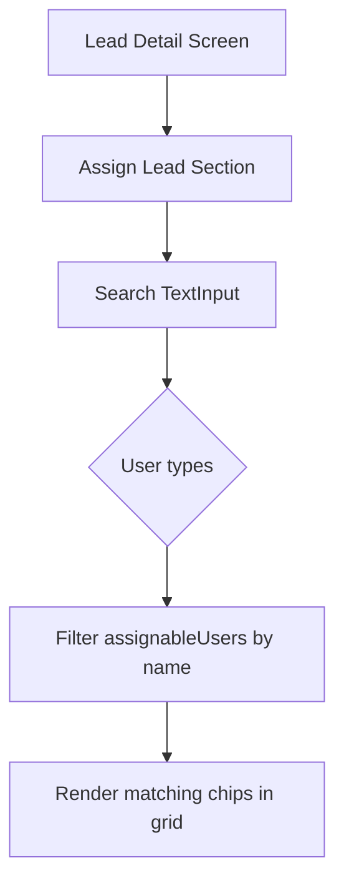

# Plan: Add Search to "Assign Lead" Section on Lead Detail Screen

## Context

On [`LeadDetailScreen.tsx`](frontend/src/screens/LeadDetailScreen.tsx:1070), the "Assign Lead" section renders all team members as tappable chips in a `flexWrap` grid. When the team is large, finding a specific member is cumbersome.

## Proposed Approach: Inline Search Filter

Add a `TextInput` search bar above the assignable users grid. Typing filters the displayed chips in real-time — keeping the same chip-based UX.

## Changes Required

### File: [`LeadDetailScreen.tsx`](frontend/src/screens/LeadDetailScreen.tsx)

1. **Add `assignSearch` state** (after line 111):
   - `const [assignSearch, setAssignSearch] = React.useState('');`

2. **Create a filtered version of `assignableUsers`** (after line 171):
   - `const filteredAssignableUsers = React.useMemo(() => { ... }, [assignableUsers, assignSearch])`
   - Filter by name (case-insensitive `includes`)

3. **Add search `TextInput` inside the "Assign Lead" section** (before the `statusGrid` at line 1073):
   - Styled similarly to other search inputs in the app
   - Placeholder: "Search team members..."
   - `value={assignSearch}` / `onChangeText={setAssignSearch}`

4. **Use `filteredAssignableUsers` instead of `assignableUsers`** in the grid (line 1074):
   - Replace `assignableUsers.map(...)` with `filteredAssignableUsers.map(...)`

## Visual Flow

## Edge Cases

- **Empty search**: Shows all users (same as current behavior)
- **No matches**: Show "No team members found" text
- **Search cleared**: Immediately restores full list