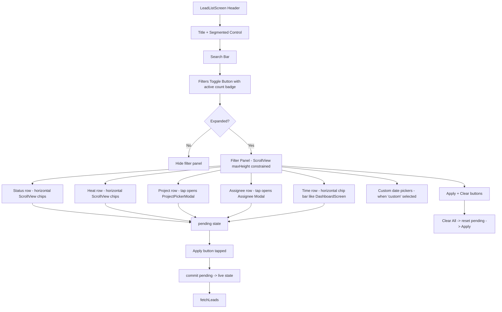

# Lead List Screen — Unified Collapsible Filter Panel (v2)

## Overview
Move **all filters** (status, heat, project, assignee, time) into a single collapsible filter panel below the search bar. Panel has a constrained `maxHeight` with inner `ScrollView`, **pending state** (filters only apply on "Apply" button tap), and time period uses horizontal chip bar matching DashboardScreen's look. All filters combine using AND logic.

---

## Architecture



---

## Changes Needed

### 1. Backend: Include superadmin in getTeamList
**File:** [`backend/src/controllers/userController.ts`](backend/src/controllers/userController.ts:20)

Change line 20 from:
```typescript
role: { $in: ['staff', 'admin'] }
```
to:
```typescript
role: { $in: ['staff', 'admin', 'superadmin'] }
```

### 2. Frontend: Constrain filter panel height
**File:** [`frontend/src/screens/LeadListScreen.tsx`](frontend/src/screens/LeadListScreen.tsx:1)

- Wrap the entire expanded filter panel content in a `<ScrollView>` with `maxHeight: 340` and `nestedScrollEnabled`
- This prevents the panel from taking over the screen — user can scroll within the panel AND scroll the lead list below

### 3. Frontend: Pending state + Apply button
Replace direct filter state with a two-layer approach:

**Pending state (editing):**
```typescript
const [pendingStatus, setPendingStatus] = useState(selectedStatus);
const [pendingTemp, setPendingTemp] = useState(selectedTemp);
const [pendingProjectId, setPendingProjectId] = useState<string | null>(null);
const [pendingProjectName, setPendingProjectName] = useState('');
const [pendingAssignee, setPendingAssignee] = useState('');
const [pendingAssigneeName, setPendingAssigneeName] = useState('');
const [pendingTimePeriod, setPendingTimePeriod] = useState<TimePeriod>('all');
const [pendingCustomFrom, setPendingCustomFrom] = useState<Date>(...);
const [pendingCustomTo, setPendingCustomTo] = useState<Date>(...);
```

**On panel expand:** Copy live state → pending state
**On "Apply" tap:** Copy pending state → live state, collapse panel, trigger fetchLeads
**On "Clear All" tap:** Reset pending state, then auto-apply

**Apply button:** Styled primary button at the bottom of the panel:
```
[Clear All Filters]     [Apply Filters]
```

The active count badge on the toggle always reflects **live** (applied) state, not pending.

### 4. Frontend: Time period as horizontal chip bar
Replace the cycling row with a horizontal ScrollView of chips — exactly matching DashboardScreen's pattern:

```
Weekly  |  Monthly  |  Quarterly  |  Yearly  |  Custom
```

- Each chip is styled identically to status/heat chips
- When "Custom" is active, the date picker rows appear below (same as DashboardScreen)
- Uses `pendingTimePeriod` for selection; commits on Apply

### 5. Frontend: Panel structure (final)
```
┌──────────────────────────────────────────┐
│  🔍 Filters (3 active)              ▼   │  ← Toggle (shows live count)
├──────────────────────────────────────────┤
│  ┌─ ScrollView (maxHeight: 340) ───────┐│
│  │ Status:                              ││
│  │ ← [All][NEW][CALLBACK]...[INVALID]→ ││
│  │                                      ││
│  │ Heat:                                ││
│  │ ← [All][HOT][WARM][COLD] →          ││
│  │                                      ││
│  │ Project:                             ││
│  │ 🏗️ All Projects          >         ││
│  │                                      ││
│  │ Assignee:                            ││
│  │ 👤 All Staff               >         ││
│  │                                      ││
│  │ Time:                                ││
│  │ ← [Weekly][Monthly][Qtrly][Yr][Cst]→││
│  │                                      ││
│  │ [Custom date picker if 'custom']     ││
│  │                                      ││
│  │ [Clear All Filters]  [Apply Filters] ││ ← Buttons
│  └──────────────────────────────────────┘│
└──────────────────────────────────────────┘
```

---

## Files Touched

| File | Change |
|------|--------|
| [`backend/src/controllers/userController.ts`](backend/src/controllers/userController.ts:20) | Add `'superadmin'` to role filter in getTeamList |
| [`frontend/src/screens/LeadListScreen.tsx`](frontend/src/screens/LeadListScreen.tsx:1) | Add pending state layer; wrap panel in ScrollView with maxHeight; change time to chip bar; add Apply/Clear buttons |