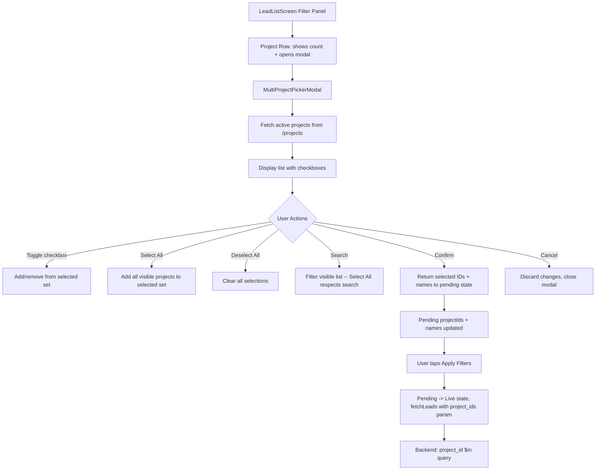

# Project Filter — Multi-Select Implementation Plan

## Overview

Replace the current single-project filter on the Lead List screen with a multi-select project filter. Users will be able to pick multiple projects, with a "Select All" option. A new dedicated `MultiProjectPickerModal` component will be created, leaving the existing single-select `ProjectPickerModal` untouched for other screens.

---

## Architecture



---

## Files Changed

| File | Change |
|------|--------|
| [`backend/src/controllers/leadController.ts`](backend/src/controllers/leadController.ts:318) | Accept comma-separated `project_ids` alongside legacy `project_id` |
| [`frontend/src/components/MultiProjectPickerModal.tsx`](frontend/src/components/MultiProjectPickerModal.tsx) | **NEW** — Multi-select project picker with checkboxes, search, Select All |
| [`frontend/src/screens/LeadListScreen.tsx`](frontend/src/screens/LeadListScreen.tsx:1) | State, fetchLeads, filter UI, apply/clear logic — all updated for multi-select |

---

## Step-by-Step Implementation

### Step 1: Backend — Update `getLeads` to support multiple project IDs

**File:** [`backend/src/controllers/leadController.ts`](backend/src/controllers/leadController.ts:318)

**What changes:**

Replace lines 318–320:
```typescript
// Filter by project (ObjectId reference)
if (project_id && mongoose.Types.ObjectId.isValid(project_id as string)) {
  query.project_id = new mongoose.Types.ObjectId(project_id as string);
}
```

With:
```typescript
// Filter by project(s) — supports comma-separated project_ids (multi-select)
// Also supports legacy single project_id for backward compatibility
const projectIdsRaw = req.query.project_ids as string | undefined;
const singleProjectId = req.query.project_id as string | undefined;

if (projectIdsRaw) {
  const ids = projectIdsRaw.split(',').filter(id => mongoose.Types.ObjectId.isValid(id));
  if (ids.length > 0) {
    query.project_id = ids.length === 1
      ? new mongoose.Types.ObjectId(ids[0])
      : { $in: ids.map(id => new mongoose.Types.ObjectId(id)) };
  }
} else if (singleProjectId && mongoose.Types.ObjectId.isValid(singleProjectId)) {
  query.project_id = new mongoose.Types.ObjectId(singleProjectId);
}
```

**Note:** The `project_id` field on the Lead model stores an ObjectId reference to the Project collection. The multi-select sends multiple IDs comma-separated; the backend uses MongoDB's `$in` operator to match any of them.

---

### Step 2: Frontend — Create `MultiProjectPickerModal` component

**File:** [`frontend/src/components/MultiProjectPickerModal.tsx`](frontend/src/components/MultiProjectPickerModal.tsx) (NEW)

**Props interface:**
```typescript
interface Props {
  visible: boolean;
  onClose: () => void;
  onConfirm: (projectIds: string[], projectNames: string[]) => void;
  selectedProjectIds: string[];  // pre-selected IDs when modal opens
}
```

**Component behavior:**

1. **On mount / `visible` change:** Fetch all active projects via `GET /projects?status=active` (same API as existing `ProjectPickerModal`)
2. **Local state:** `selectedIds: Set<string>` initialized from `selectedProjectIds` prop
3. **Search:** Filters the list by project name (same as existing)
4. **Each project row:** Shows a checkbox/toggle on the right side, project name + location on the left
5. **Select All:** A sticky header row that toggles all **currently filtered** projects. If all filtered projects are selected → shows "Deselect All". Otherwise → shows "Select All"
6. **Selection count badge:** Shows `"X selected"` in the header
7. **Confirm button:** Calls `onConfirm(ids, names)` then `onClose()`
8. **Cancel:** Closes without calling `onConfirm`

**UI Layout:**
```
┌─────────────────────────────────────┐
│  Select Projects              ✕    │  ← Header with close
│  ┌─────────────────────────────┐    │
│  │ 🔍 Search projects...       │    │  ← Search input
│  └─────────────────────────────┘    │
│  ┌─────────────────────────────┐    │
│  │ [✓] Select All (3 selected) │    │  ← Sticky Select All row
│  └─────────────────────────────┘    │
│  ┌─ ScrollView ────────────────┐    │
│  │ 🏗️ Project A     [✓]      │    │  ← Checkable rows
│  │ 🏗️ Project B     [ ]      │    │
│  │ 🏗️ Project C     [✓]      │    │
│  │ 🏗️ Project D     [✓]      │    │
│  └─────────────────────────────┘    │
│                                     │
│  [Cancel]              [Confirm]    │  ← Bottom buttons
└─────────────────────────────────────┘
```

**Key implementation details:**
- Use `Set<string>` for efficient add/remove O(1) operations
- Derive `selectedNames` from the full projects list when confirming
- The "Select All" toggle respects the search filter — only toggles visible projects
- When projects are loading, show an `ActivityIndicator`
- Reuse existing styling patterns from `ProjectPickerModal` (Colors, borderRadius, etc.)

---

### Step 3: Frontend — Update LeadListScreen state

**File:** [`frontend/src/screens/LeadListScreen.tsx`](frontend/src/screens/LeadListScreen.tsx:71)

**State changes:**

Remove:
```typescript
const [selectedProjectId, setSelectedProjectId] = useState<string | null>(null);
const [selectedProjectName, setSelectedProjectName] = useState<string>('');
const [pendingProjectId, setPendingProjectId] = useState<string | null>(null);
const [pendingProjectName, setPendingProjectName] = useState('');
```

Add:
```typescript
// ─── Live (applied) filter state ───
const [selectedProjectIds, setSelectedProjectIds] = useState<string[]>([]);
const [selectedProjectNames, setSelectedProjectNames] = useState<string[]>([]);

// ─── Pending filter state ───
const [pendingProjectIds, setPendingProjectIds] = useState<string[]>([]);
const [pendingProjectNames, setPendingProjectNames] = useState<string[]>([]);
```

---

### Step 4: Frontend — Update `fetchLeads` query params

**File:** [`frontend/src/screens/LeadListScreen.tsx`](frontend/src/screens/LeadListScreen.tsx:206)

**Change:**

Remove lines 206–208:
```typescript
if (selectedProjectId) {
  params.push(`project_id=${encodeURIComponent(selectedProjectId)}`);
}
```

Replace with:
```typescript
if (selectedProjectIds.length > 0) {
  params.push(`project_ids=${encodeURIComponent(selectedProjectIds.join(','))}`);
}
```

---

### Step 5: Frontend — Update filter panel UI

**File:** [`frontend/src/screens/LeadListScreen.tsx`](frontend/src/screens/LeadListScreen.tsx:559)

**Replace the existing Project row (lines 559–578)** with:

```tsx
{/* Project Row — Multi-Select */}
<TouchableOpacity
  style={styles.filterSelectRow}
  onPress={() => setProjectPickerOpen(true)}
>
  <Text style={styles.filterSelectLabel}>
    🏗️  Project: {pendingProjectNames.length === 0
      ? 'All Projects'
      : pendingProjectNames.length === 1
        ? pendingProjectNames[0]
        : `${pendingProjectNames.length} selected`}
  </Text>
  {pendingProjectIds.length > 0 ? (
    <TouchableOpacity
      onPress={() => { setPendingProjectIds([]); setPendingProjectNames([]); }}
      hitSlop={{ top: 10, bottom: 10, left: 10, right: 10 }}
      style={styles.filterClearInlineBtn}
    >
      <Text style={styles.filterClearInlineText}>✕</Text>
    </TouchableOpacity>
  ) : (
    <Text style={styles.filterSelectChevron}>›</Text>
  )}
</TouchableOpacity>
```

**Replace the `ProjectPickerModal` usage (lines 383–399)** with:

```tsx
{/* ─── Multi-Project Picker Modal ─── */}
<MultiProjectPickerModal
  visible={projectPickerOpen}
  onClose={() => setProjectPickerOpen(false)}
  onConfirm={(ids, names) => {
    setPendingProjectIds(ids);
    setPendingProjectNames(names);
  }}
  selectedProjectIds={pendingProjectIds}
/>
```

**Add the import** at the top of the file:
```typescript
import { MultiProjectPickerModal } from '../components/MultiProjectPickerModal';
```

---

### Step 6: Frontend — Update `applyFilters`, `clearAllFilters`, `openFilterPanel`, and `activeFilterCount`

**File:** [`frontend/src/screens/LeadListScreen.tsx`](frontend/src/screens/LeadListScreen.tsx:111)

**`activeFilterCount` (line 111–117):**

Change `selectedProjectId ? 1 : 0` → `selectedProjectIds.length > 0 ? 1 : 0`:
```typescript
const activeFilterCount = [
  selectedStatus !== 'All' ? 1 : 0,
  selectedTemp !== 'All' ? 1 : 0,
  selectedProjectIds.length > 0 ? 1 : 0,
  selectedAssignee ? 1 : 0,
  timePeriod !== 'all' ? 1 : 0,
].reduce((a, b) => a + b, 0);
```

**`openFilterPanel` (lines 120–131):**

Change:
```typescript
setPendingProjectId(selectedProjectId);
setPendingProjectName(selectedProjectName);
```
To:
```typescript
setPendingProjectIds([...selectedProjectIds]);
setPendingProjectNames([...selectedProjectNames]);
```

**`applyFilters` (lines 134–145):**

Change:
```typescript
setSelectedProjectId(pendingProjectId);
setSelectedProjectName(pendingProjectName);
```
To:
```typescript
setSelectedProjectIds([...pendingProjectIds]);
setSelectedProjectNames([...pendingProjectNames]);
```

**`clearAllFilters` (lines 148–156):**

Change:
```typescript
setPendingProjectId(null);
setPendingProjectName('');
```
To:
```typescript
setPendingProjectIds([]);
setPendingProjectNames([]);
```

**`clearAllAndApply` (lines 158–169):**

Change:
```typescript
setSelectedProjectId(null);
setSelectedProjectName('');
```
To:
```typescript
setSelectedProjectIds([]);
setSelectedProjectNames([]);
```

---

### Step 7: Frontend — Remove unused `ProjectPickerModal` import (optional cleanup)

The `ProjectPickerModal` import on line 21 may still be used elsewhere in the file — check if it's referenced anywhere other than the removed block. If not, remove the import. Since line 383–399 is the only usage, remove:

```typescript
import { ProjectPickerModal } from '../components/ProjectPickerModal';
```

---

## Verification Checklist

- [ ] Backend accepts `GET /leads?project_ids=id1,id2,id3` and returns matching leads
- [ ] Backend still accepts legacy `GET /leads?project_id=singleId` (backward compat)
- [ ] MultiProjectPickerModal opens, loads projects, allows multi-selection with checkboxes
- [ ] "Select All" toggles all currently filtered (searched) projects
- [ ] Confirm returns the selected IDs + names; Cancel discards changes
- [ ] Pre-selected projects are checked when modal reopens
- [ ] Filter panel shows "All Projects", single name, or "N selected"
- [ ] Clear inline button (✕) resets project filter
- [ ] Apply Filters commits pending → live and triggers fetchLeads with `project_ids`
- [ ] Clear All Filters resets everything including projects
- [ ] Active filter count badge increments when projects are selected
- [ ] Existing single-select ProjectPickerModal continues to work on other screens