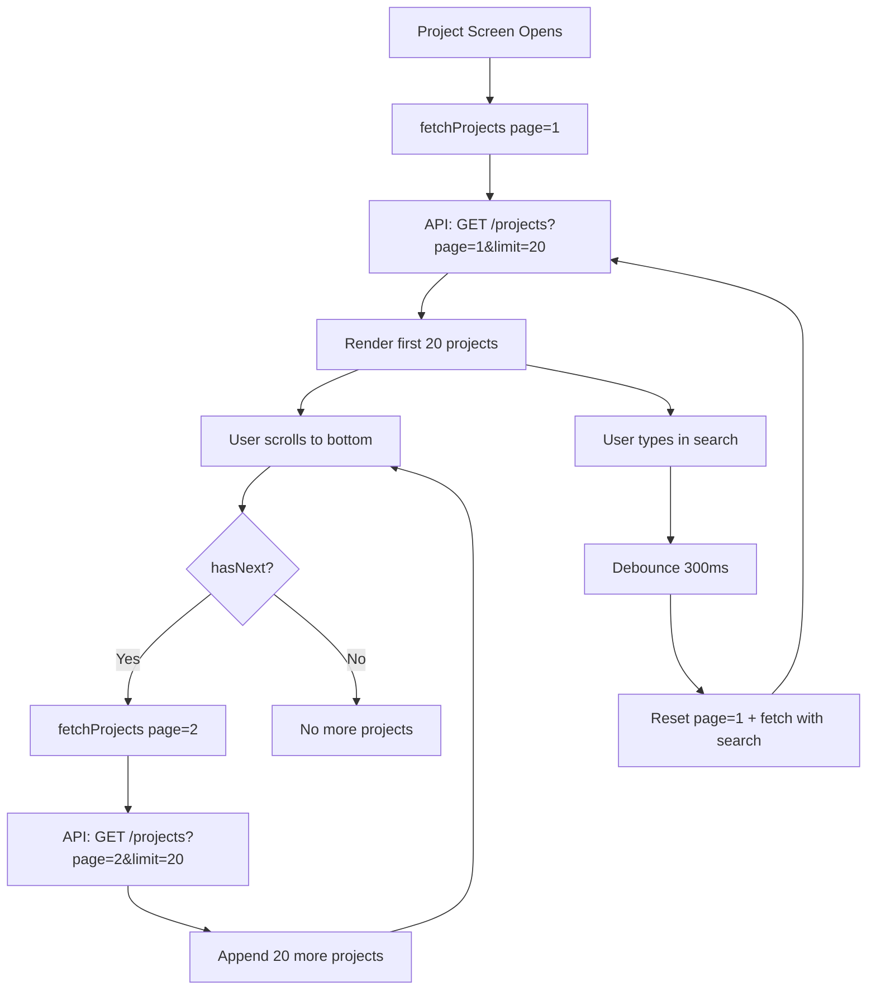

# Plan: Search + Pagination for Project Management / Project Catalog

## Current State

**Backend** ([`projectController.ts`](backend/src/controllers/projectController.ts:10)):
- `GET /projects` returns **all projects** at once — no search, no pagination
- Only supports `?status=active` filter

**Frontend** ([`ProjectManagementScreen.tsx`](frontend/src/screens/ProjectManagementScreen.tsx)):
- `FlatList` renders all projects fetched in one shot
- No search bar
- No pagination — if there are 200 projects, all 200 load into memory and render

## Changes Required

### 1. Backend: Add search + pagination to `GET /projects`

**File**: [`projectController.ts`](backend/src/controllers/projectController.ts:10)

| Change | Detail |
|--------|--------|
| Import `parsePagination` and `buildPaginationMeta` | From [`pagination.ts`](backend/src/utils/pagination.ts) |
| Parse `?search=` query param | Case-insensitive name match |
| Parse `?page=` and `?limit=` query params | Via `parsePagination(req.query)` |
| Build filter with `$regex` | When `search` is provided |
| Add `.skip()` and `.limit()` | To the query |
| Add `countDocuments` | For total count |
| Return `pagination` meta in response | `{ page, size, totalRecords, totalPages, hasNext, hasPrev }` |

**Response shape** (backward compatible — `data` still an array):
```json
{
  "success": true,
  "data": [...],
  "pagination": { "page": 1, "size": 20, "totalRecords": 45, "totalPages": 3, "hasNext": true, "hasPrev": false }
}
```

### 2. Frontend: Add search bar + infinite scroll pagination

**File**: [`ProjectManagementScreen.tsx`](frontend/src/screens/ProjectManagementScreen.tsx)

| Change | Detail |
|--------|--------|
| Add `searchText` state | Controls the search TextInput |
| Add `searchTimeout` ref | Debounce search (300ms) |
| Add pagination state | `page`, `totalPages`, `hasNext`, `loadingMore` |
| Modify `fetchProjects` | Accept `search` + `page` params; append to list on page > 1 |
| Add search `TextInput` | At top of the list |
| Add pagination logic in `FlatList` | `onEndReached` → load next page |
| Add "Load More" footer | ActivityIndicator when loading more |
| Add `PaginatedResponse` type | In [`types/index.ts`](frontend/src/types/index.ts) |



## Files Modified

| # | File | What |
|---|------|------|
| 1 | [`projectController.ts`](backend/src/controllers/projectController.ts) | Add search + pagination |
| 2 | [`ProjectManagementScreen.tsx`](frontend/src/screens/ProjectManagementScreen.tsx) | Add search bar + infinite scroll |
| 3 | [`types/index.ts`](frontend/src/types/index.ts) | Add `PaginatedResponse<T>` type (if not already present) |

## Edge Cases

- **Empty search**: Returns all projects (paginated) — same as current behavior
- **No results**: Shows "No projects found" message
- **Page > totalPages**: Returns empty array
- **Status + search combined**: Filter by both `status` and `search`
- **Debounce**: Prevents API call on every keystroke