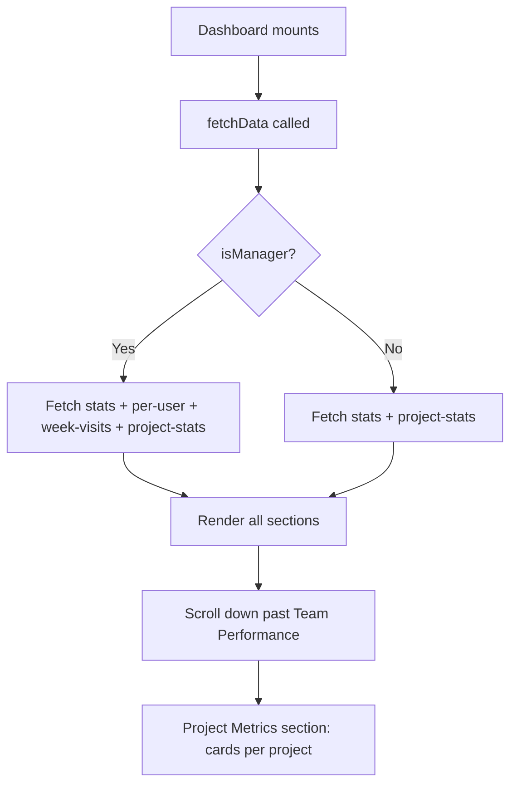

# Project Metrics on Dashboard

## Overview

Add a **project metrics section below "Team Performance"** on the dashboard. Each active project appears as a card showing **4 simple numbers**: total leads, visited count, booked count, and today's visits. The section respects the same time period filter as the rest of the dashboard. The rest of the dashboard remains **untouched**.

---

## Architecture Flow



---

## What Each Project Card Shows

| Metric | Source | Color |
|--------|--------|-------|
| Total Leads | Count of leads with that `project_id` | `Colors.primary` (blue) |
| Visited | Sum of `visit_count` for leads in that project | `#0d9488` (teal) |
| Booked | Count of leads with status `BOOKED` | `Colors.success` (green) |
| Today's Visits | Count of leads with `status` in `VISIT_BOOKED,RE_VISIT` AND `site_visit_at` falls on today | `#06b6d4` (cyan) |

---

## Todo List

1. **Backend: Add `GET /api/leads/project-stats` endpoint** — aggregate per-project lead counts
2. **Backend: Register route** in [`leadRoutes.ts`](backend/src/routes/leadRoutes.ts:6)
3. **Frontend: Add `ProjectStat` type** in [`types/index.ts`](frontend/src/types/index.ts:1)
4. **Frontend: Fetch project stats in DashboardScreen** — call the new endpoint during `fetchData`
5. **Frontend: Render project cards section** — below Team Performance, with project name + 3 stat values
6. **Frontend: Add styles** — card layout matching existing design language

---

## Details Per File

### 1. Backend — New controller function in [`leadController.ts`](backend/src/controllers/leadController.ts:81)

Add `getProjectStats` after the existing `getWeekVisits` function:

```typescript
export const getProjectStats = async (req: AuthRequest, res: Response) => {
  try {
    const organization_id = req.user?.organization_id;
    const { from, to } = req.query;

    if (!organization_id || !mongoose.Types.ObjectId.isValid(organization_id as string)) {
      return res.json({ success: true, data: [] });
    }

    const orgId = new mongoose.Types.ObjectId(organization_id as string);
    const matchQuery: any = {
      organization_id: orgId,
      project_id: { $ne: null },  // only leads linked to a project
    };

    // Staff can only see their own leads
    if (req.user?.role === 'staff') {
      matchQuery.assigned_to = new mongoose.Types.ObjectId(req.user.id);
    }

    // Time filter
    if (from && to) {
      matchQuery.created_at = { $gte: new Date(from as string), $lte: new Date(to as string) };
    }

    // Exclude inactive Facebook pages (same as getDashboardStats)
    const org = await Organization.findById(organization_id);
    if (org && org.meta_config?.pages) {
      const inactivePageNames = org.meta_config.pages
        .filter((p: any) => p.is_active === false)
        .map((p: any) => p.page_name);
      if (inactivePageNames.length > 0) {
        matchQuery.facebook_page_name = { $nin: inactivePageNames };
      }
    }

    // Compute today's date range in UTC for visits_today per project
    const todayStart = new Date();
    todayStart.setHours(0, 0, 0, 0);
    const todayEnd = new Date();
    todayEnd.setHours(23, 59, 59, 999);

    const projectStats = await Lead.aggregate([
      { $match: matchQuery },
      {
        $group: {
          _id: '$project_id',
          total_leads: { $sum: 1 },
          visited: { $sum: '$visit_count' },
          booked: { $sum: { $cond: [{ $eq: ['$status', 'BOOKED'] }, 1, 0] } },
          visits_today: {
            $sum: {
              $cond: [
                {
                  $and: [
                    { $in: ['$status', ['VISIT_BOOKED', 'RE_VISIT']] },
                    { $gte: ['$site_visit_at', todayStart] },
                    { $lte: ['$site_visit_at', todayEnd] },
                  ],
                },
                1,
                0,
              ],
            },
          },
        },
      },
      { $sort: { total_leads: -1 } },
    ]);

    // Populate project names
    const projectIds = projectStats.map((p: any) => p._id);
    const projects = await Project.find({ _id: { $in: projectIds } }).select('name');
    const projectNameMap: Record<string, string> = {};
    projects.forEach((p: any) => {
      projectNameMap[p._id.toString()] = p.name;
    });

    const result = projectStats.map((p: any) => ({
      project_id: p._id,
      project_name: projectNameMap[p._id.toString()] || 'Unknown Project',
      total_leads: p.total_leads,
      visited: p.visited,
      booked: p.booked,
      visits_today: p.visits_today,
    }));

    res.json({ success: true, data: result });
  } catch (error) {
    console.error('[Get Project Stats Error]:', error);
    res.status(500).json({ success: false, message: 'Server error' });
  }
};
```

**Imports needed at top of file:** Add `import Project from '../models/Project';`

### 2. Backend — Route in [`leadRoutes.ts`](backend/src/routes/leadRoutes.ts:6)

Add import and route:

```typescript
// Update import line 2 to include getProjectStats
import { ..., getProjectStats } from '../controllers/leadController';

// Add route (before /stats to avoid conflict):
router.get('/project-stats', getProjectStats);
```

### 3. Frontend — Type in [`types/index.ts`](frontend/src/types/index.ts:1)

Add after the existing `WeekVisitsResponse` interface:

```typescript
export interface ProjectStat {
  project_id: string;
  project_name: string;
  total_leads: number;
  visited: number;
  booked: number;
  visits_today: number;
}
```

### 4. Frontend — Fetch in [`DashboardScreen.tsx`](frontend/src/screens/DashboardScreen.tsx:83)

**Add state (around line 112):**
```typescript
const [projectStats, setProjectStats] = useState<ProjectStat[]>([]);
```

**Add import (line 16):**
```typescript
import type { WeekDay, WeekVisitsResponse, ProjectStat } from '../types';
```

**Update `fetchData` (around line 130):**
For both manager and non-manager paths, add the project-stats fetch. For managers, add it as a 4th promise in `Promise.all`. For staff, add a second `await`:

```typescript
// Manager path (line 137-148):
const [statsRes, perUserRes, weekRes, projectRes] = await Promise.all([
  client.get(`/leads/stats${query}`),
  client.get(`/leads/per-user-stats${query}`),
  client.get(`/leads/week-visits`),
  client.get(`/leads/project-stats${query}`),
]);
// ... existing handlers ...
if (projectRes.data.success) setProjectStats(projectRes.data.data);

// Staff path (line 149-151):
const statsRes = await client.get(`/leads/stats${query}`);
if (statsRes.data.success) setStats(statsRes.data.data);
const projectRes = await client.get(`/leads/project-stats${query}`);
if (projectRes.data.success) setProjectStats(projectRes.data.data);
```

### 5. Frontend — Render section in [`DashboardScreen.tsx`](frontend/src/screens/DashboardScreen.tsx:483)

Add **after the Team Performance section** (after line 492, before the closing `</ScrollView>`):

```tsx
{/* ─── Project Metrics ─── */}
{projectStats.length > 0 && (
  <View style={styles.section}>
    <Text style={styles.sectionTitle}>Project Performance</Text>
    {projectStats.map((proj) => (
      <View key={proj.project_id} style={styles.projectCard}>
        <Text style={styles.projectCardName}>{proj.project_name}</Text>
        <View style={styles.projectMetricsRow}>
          <View style={styles.projectMetric}>
            <Text style={[styles.projectMetricValue, { color: Colors.primary }]}>
              {proj.total_leads}
            </Text>
            <Text style={styles.projectMetricLabel}>Leads</Text>
          </View>
          <View style={styles.projectMetric}>
            <Text style={[styles.projectMetricValue, { color: '#0d9488' }]}>
              {proj.visited}
            </Text>
            <Text style={styles.projectMetricLabel}>Visited</Text>
          </View>
          <View style={styles.projectMetric}>
            <Text style={[styles.projectMetricValue, { color: Colors.success }]}>
              {proj.booked}
            </Text>
            <Text style={styles.projectMetricLabel}>Booked</Text>
          </View>
          <View style={styles.projectMetric}>
            <Text style={[styles.projectMetricValue, { color: '#06b6d4' }]}>
              {proj.visits_today}
            </Text>
            <Text style={styles.projectMetricLabel}>Today</Text>
          </View>
        </View>
      </View>
    ))}
    {!loading && projectStats.length === 0 && (
      <View style={styles.placeholderCard}>
        <Text style={styles.placeholderText}>No project data in this period.</Text>
      </View>
    )}
  </View>
)}
```

### 6. Frontend — Styles in [`DashboardScreen.tsx`](frontend/src/screens/DashboardScreen.tsx:497)

Add to the `styles` StyleSheet:

```typescript
/* Project cards */
projectCard: {
  backgroundColor: Colors.surface,
  borderRadius: 14,
  padding: 16,
  marginBottom: 10,
  borderWidth: 1,
  borderColor: Colors.border,
},
projectCardName: {
  fontSize: 15,
  fontWeight: '800',
  color: Colors.text,
  marginBottom: 12,
},
projectMetricsRow: {
  flexDirection: 'row',
  justifyContent: 'space-around',
},
projectMetric: {
  alignItems: 'center',
  flex: 1,
},
projectMetricValue: {
  fontSize: 22,
  fontWeight: '800',
},
projectMetricLabel: {
  fontSize: 11,
  color: Colors.textSecondary,
  fontWeight: '600',
  marginTop: 2,
},
```

---

## Visual Layout (Dashboard scroll order)

```
┌─────────────────────────────┐
│  Header (Hello, Name)       │
├─────────────────────────────┤
│  Time Period Filters        │  ← unchanged
├─────────────────────────────┤
│  Stat Cards (4)             │  ← unchanged
├─────────────────────────────┤
│  Week Strip (manager only)  │  ← unchanged
├─────────────────────────────┤
│  Pipeline Status (8 tiles)  │  ← unchanged
├─────────────────────────────┤
│  🏗️ Manage Projects btn    │  ← unchanged
├─────────────────────────────┤
│  Team Performance           │  ← unchanged (manager only)
├─────────────────────────────┤
│  ✨ Project Performance ✨  │  ← NEW SECTION
│  ┌─────────────────────┐    │
│  │ Project Alpha       │    │
│  │  12 Lds  5 Vst  2 Bk│    │
│  │  3 Today            │    │
│  ├─────────────────────┤    │
│  │ Project Beta        │    │
│  │  8 Lds   3 Vst  1 Bk│    │
│  │  0 Today            │    │
│  └─────────────────────┘    │
└─────────────────────────────┘
```

---

## Edge Cases

| Case | Handling |
|------|----------|
| No projects exist | Section hidden entirely (`projectStats.length > 0` guard) |
| Projects exist but no leads in time period | Empty state placeholder shown |
| Leads without `project_id` | Excluded from aggregation (`project_id: { $ne: null }`) |
| Staff user viewing | Only sees leads assigned to them |
| Inactive Facebook pages | Leads from inactive pages excluded (same as existing stats) |
| Time period filter | Respected via `from`/`to` query params |