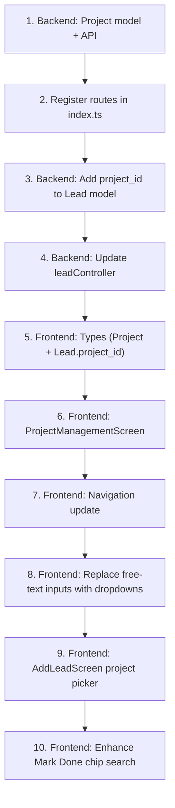

# Projects CRUD System — Implementation Plan

## Overview
Move from free-text project names to a managed project catalog. Admin/superadmin manages projects with configurations. All project inputs become type-to-search dropdowns with catalog validation and "Other (custom)" fallback.

## Confirmed Design Decisions
- **Configurations**: `type` + `size` only (no price_range)
- **Dropdown fallback**: "Other (custom)" free-text allowed
- **Disabled projects**: Hidden from dropdowns, still visible in visit history (historical data preserved)
- **Add Lead screen**: Add project dropdown in this pass

---

## Phase 1 — Implementation

### 1. New Backend Model: [`backend/src/models/Project.ts`](backend/src/models/Project.ts) (NEW)

```typescript
interface IProject {
  organization_id: ObjectId;
  name: string;
  location?: string;
  builder?: string;
  description?: string;
  configurations?: Array<{
    type: string;    // "2BHK", "3BHK", "Penthouse"
    size?: string;   // "1200 sqft"
  }>;
  status: 'active' | 'inactive';
  created_at: Date;
  updated_at: Date;
}
```

Index on `{ organization_id: 1, status: 1 }` for fast active-project lookups.

### 2. New Backend API: Project Routes + Controller

**Routes** (`backend/src/routes/projectRoutes.ts`):
```
GET    /api/projects              → list projects for org (filter by ?status=active)
POST   /api/projects              → create project (admin/superadmin only)
PUT    /api/projects/:id          → update project (admin/superadmin only)
DELETE /api/projects/:id          → soft-delete (status: 'inactive')
```

**Controller** (`backend/src/controllers/projectController.ts`):
- `getProjects`: supports `?status=active` query param
- `createProject`: validates name uniqueness per org
- `updateProject`: full update including configurations array
- `deleteProject`: sets `status: 'inactive'` (soft delete)

**Middleware**: `auth` required for all. `create`, `update`, `delete` require admin/superadmin role.

### 3. Lead Model Change: [`backend/src/models/Lead.ts`](backend/src/models/Lead.ts)

Add `project_id` as optional reference — hybrid approach (keep `project` string too):

```typescript
// Interface additions:
project_id?: mongoose.Types.ObjectId;  // reference to Project
// project?: string;                   // KEEP existing — denormalized display name

// Schema additions:
project_id: { type: Schema.Types.ObjectId, ref: 'Project', default: null },
// project: { type: String },         // KEEP existing
```

### 4. Lead Controller: [`backend/src/controllers/leadController.ts`](backend/src/controllers/leadController.ts)

**Destructure** `project_id` from `req.body`:
```typescript
const { ..., project_id } = req.body;
```

**Store** `project_id` alongside `project`:
```typescript
if (project_id !== undefined) updateData.project_id = project_id;
// project string is still accepted for backward compat + "Other" fallback
if (project !== undefined) updateData.project = project;
```

**visit_history entries** — when status === 'VISITED':
- If `visit_projects` is sent (chip input), use those project names directly (these are display strings, already validated against catalog or entered as custom)
- `project_id` is NOT stored in visit_history entries — visit_history keeps `project: string` for historical display

**getLeads/aggregations** — No changes needed for now. `project_id` enables future `$group` queries.

### 5. Frontend Types: [`frontend/src/types/index.ts`](frontend/src/types/index.ts)

```typescript
// New Project type
export interface Project {
  _id: string;
  organization_id: string;
  name: string;
  location?: string;
  builder?: string;
  description?: string;
  configurations?: Array<{ type: string; size?: string }>;
  status: 'active' | 'inactive';
  created_at: string;
  updated_at: string;
}

// Lead additions:
export interface Lead {
  // ... existing fields ...
  project_id?: string;     // reference to Project._id
  // project?: string;    // KEEP existing
}
```

### 6. New Frontend Screen: [`frontend/src/screens/ProjectManagementScreen.tsx`](frontend/src/screens/ProjectManagementScreen.tsx) (NEW)

**Route**: Accessible from admin/superadmin dashboard or settings section.

**Two tabs:**
- **Projects List** — scrollable list of all projects (active + inactive toggleable)
  - Each row: project name, location, builder, status badge
  - Tap → expand to show configurations
  - Swipe or long-press → edit / disable
- **Add/Edit Project** — form
  - Name (required), Location, Builder, Description
  - Configurations: dynamic list with `+ Add Configuration` button
    - Each row: Type (TextInput) + Size (TextInput) + Delete button
  - Save → POST or PUT

**Access control**: Only visible to admin/superadmin roles.

### 7. Reusable Dropdown Component (in LeadDetailScreen, later extractable)

A self-contained modal/action-sheet for selecting projects:

```
┌───────────────────────────────────────┐
│  Select Project                       │
│  ┌─────────────────────────────────┐  │
│  │ 🔍 Search projects...           │  │
│  └─────────────────────────────────┘  │
│                                       │
│  ○ Green Valley                       │
│    Whitefield | Prestige Group        │
│  ○ Skyline Towers                     │
│    Indiranagar | Brigade Group        │
│  ○ Palm Residency                     │
│    Sarjapur | Sobha Developers        │
│                                       │
│  ○ + Other (custom project name)     │
│                                       │
│  [Cancel]                             │
└───────────────────────────────────────┘
```

**Behavior:**
- Fetches active projects on mount (`GET /api/projects?status=active`)
- Type-to-search filters the list
- Tapping a project: sets `project: proj.name` and `project_id: proj._id`
- Tapping "Other" → shows a TextInput for free-text, sets `project_id: null`
- Can be triggered from multiple contexts (status dialog, edit modal, Mark Done, Add Lead)

**Implementation approach**: Build inline in LeadDetailScreen first as a helper function. The Mark Done chip input already has a similar pattern — we enhance it so typing searches the project catalog and shows suggestions below.

### 8. Replace Free-text Inputs → Dropdowns (LeadDetailScreen)

| Context | Current | New |
|---|---|---|
| **Status dialog** (INTERESTED) | `TextInput` for project | Project picker modal on tap |
| **Edit interest modal** | `TextInput` for project | Project picker modal on tap |
| **Mark Done chip input** | Free-text → chip | Type-to-search project catalog → chip, with "Other" at bottom |
| **Visits tab** | Shows `Project: {visit.project}` | Unchanged — uses the stored string |

**Mark Done chip input enhancement**: When the agent types in the chip TextInput, we search the project catalog and show a dropdown below with matching projects + a "Add as custom" option. This preserves the chip UX while guiding toward catalog names.

### 9. Mark Done Dialog: Project Search Below Chips

```
┌──────────────────────────────────┐
│  ✓ Mark Visit as Done            │
│                                  │
│  [Green Valley ×] [Skyline ×]   │
│  ┌────────────────────────────┐  │
│  │ Palm...                    │  │
│  └────────────────────────────┘  │
│  ┌─ suggestions ──────────────┐  │
│  │ ○ Palm Residency           │  │
│  │ ○ Palm Meadows             │  │
│  │ + Add "Palm" as custom     │  │
│  └────────────────────────────┘  │
│                                  │
│  Notes per project...            │
└──────────────────────────────────┘
```

### 10. Navigation Update: [`frontend/src/navigation/AppNavigator.tsx`](frontend/src/navigation/AppNavigator.tsx)

Add `ProjectManagementScreen` to the stack navigator for admin/superadmin roles. Accessible from a button on the Dashboard or a settings section.

```typescript
<Stack.Screen name="ProjectManagement" component={ProjectManagementScreen} />
```

### 11. Add Lead Screen: [`frontend/src/screens/AddLeadScreen.tsx`](frontend/src/screens/AddLeadScreen.tsx)

Add a project picker field (same ProjectDropdown pattern):
- Opens modal listing active projects
- Stores `project` (name) and `project_id` in the lead creation payload
- Backend `createLead` controller already destructures `project` — add `project_id` there too

### 12. Backend: [Register projectRoutes](backend/src/index.ts)

```typescript
import projectRoutes from './routes/projectRoutes';
app.use('/api/projects', projectRoutes);
```

---

## Files Summary

| # | File | Status | Change |
|---|---|---|---|
| 1 | `backend/src/models/Project.ts` | **NEW** | Project model with configurations |
| 2 | `backend/src/controllers/projectController.ts` | **NEW** | CRUD operations |
| 3 | `backend/src/routes/projectRoutes.ts` | **NEW** | Route definitions |
| 4 | `backend/src/index.ts` | MODIFY | Register project routes |
| 5 | `backend/src/models/Lead.ts` | MODIFY | Add `project_id` field |
| 6 | `backend/src/controllers/leadController.ts` | MODIFY | Accept/handle `project_id` |
| 7 | `frontend/src/types/index.ts` | MODIFY | Add Project type, add `project_id` to Lead |
| 8 | `frontend/src/screens/ProjectManagementScreen.tsx` | **NEW** | Admin project CRUD UI |
| 9 | `frontend/src/screens/LeadDetailScreen.tsx` | MODIFY | Replace TextInputs with dropdown, enhance chip input |
| 10 | `frontend/src/screens/AddLeadScreen.tsx` | MODIFY | Add project dropdown |
| 11 | `frontend/src/navigation/AppNavigator.tsx` | MODIFY | Register ProjectManagement route |

---

## Execution Order



## What Stays the Same

- `visit_history` entries still use `project: string` (display name, historically accurate)
- Visit history display in Visits tab unchanged
- Cancel/Reschedule flow unchanged
- Dashboard pipeline unchanged
- All existing lead data preserved (project string still stored)