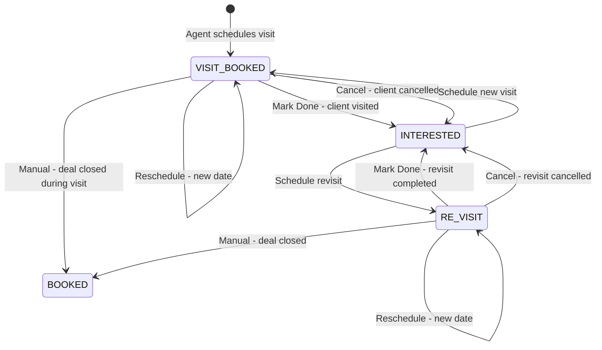

# Visit Outcome Handling — Design Plan

## Current State

When a lead is set to [`VISIT_BOOKED`](../frontend/src/screens/LeadDetailScreen.tsx:350) or [`RE_VISIT`](../frontend/src/screens/LeadDetailScreen.tsx:350), we store `site_visit_at` on the lead, create a reminder for the day before, and show a Visit Schedule Card. But there's no formal concept of what happens **after** the scheduled time passes — the lead sits in that status indefinitely.

---

## Scenario 1: Client Actually Visits / Revisits

**The visit happened. Agent met the client.**

### Flow

After a successful visit, the lead returns to [`INTERESTED`](../frontend/src/types/index.ts) — they've seen the property and are still in the negotiation/pipeline phase. BOOKED is separate; agent manually sets it if the deal closed.

### Changes

| Change | Rationale |
|---|---|
| Add **"Mark Visit Done"** button on Visit Schedule Card | Single tap to complete the visit |
| On tap → status to INTERESTED, clear `site_visit_at`, clear `next_reminder_at` | Clean up visit-specific data, keep interest data intact |
| Log activity: `"Site visit completed on {date}"` with type `visit_completed` | Audit trail |
| **Optional**: Push to `visit_history[]` array instead of discarding `site_visit_at` | Enables analytics on visit count per lead |

### Key Decision

VISIT_BOOKED → INTERESTED is a hardcoded transition (not a picker). Agent can always change to BOOKED manually afterward if needed.

---

## Scenario 2: Client Cancels the Visit

**They can't come / changed their mind.**

### Flow

1. Clear the scheduled visit
2. Cancel the reminder
3. Choose what happens to the lead

### Changes

| Change | Rationale |
|---|---|
| Add **"Cancel Visit"** button on Visit Schedule Card | One-tap cancellation |
| Show **cancellation reason picker** (chips): `client_busy`, `client_not_responding`, `client_lost_interest`, `other` | Insight into why visits fall through |
| Clear `site_visit_at`, delete reminder via [`DELETE /reminders`](../backend/src/routes/reminderRoutes.ts) | Cleanup |
| Log activity: `"Site visit cancelled — {reason}"` | Audit trail |
| Move status to **INTERESTED** (default recommendation) | Without `site_visit_at`, VISIT_BOOKED loses meaning. Keeps pipeline honest. |

### Alternative Considered

Staying in VISIT_BOOKED without a date creates pipeline clutter. Moving to INTERESTED is cleaner; agent can always re-schedule later.

---

## Scenario 3: Client Reschedules

**Different day / time wanted.**

### Flow

Re-open the date picker with current values pre-filled.

### Changes

| Change | Rationale |
|---|---|
| **"Reschedule"** button opens status dialog with date picker pre-filled to current `site_visit_at` | Saves navigation |
| On save: update `site_visit_at`, **overwrite reminder** to new day-before | Same logic as initial scheduling |
| Log activity: `"Site visit rescheduled from {old_date} to {new_date}"` | Audit trail |
| Track `reschedule_count` on lead (increment on each reschedule) | Metric — "rescheduled 3 times" may indicate low intent |
| Status stays VISIT_BOOKED or RE_VISIT | Only date/reminder shift |

---

## Visit Schedule Card — Proposed UI

```
┌─────────────────────────────────────────┐
│  📅 Site Visit Scheduled                │
│  May 28, 2026 at 11:00 AM              │
│                                         │
│  ⏰ Reminder: May 27, 10:00 AM         │
│  "Confirm with client before visit"    │
│                                         │
│  [Mark Done]  [Reschedule]  [Cancel]   │
└─────────────────────────────────────────┘
```

Three distinct buttons, each triggering their respective mini-flow with sub-dialogs where needed (cancellation reason, reschedule date picker).

---

## Optional: Visit History Tracking (V1.5 / V2)

If we add a `visit_history[]` array to the [`ILead`](../backend/src/models/Lead.ts:3) interface:

```typescript
visit_history?: Array<{
  scheduled_at: Date;
  completed_at?: Date;       // null if cancelled
  cancelled_at?: Date;       // null if completed
  cancellation_reason?: string;
  outcome?: 'completed' | 'no_show' | 'cancelled';
  reschedule_count: number;
}>;
```

This enables:
- "How many visits has this lead had?" analytics
- No-Show tracking (scheduled but didn't arrive)
- Visit-to-booking conversion rates

---

## State Machine



Key insight: **VISIT_BOOKED and RE_VISIT are transient states.** Leads return to INTERESTED after the visit (or cancellation), keeping only BOOKED as a terminal state.

---

## Implementation Priority

| Priority | Feature | Complexity |
|----------|---------|------------|
| **P1** | "Mark Visit Done" → INTERESTED + activity log | Low |
| **P1** | "Cancel Visit" with reason chips → INTERESTED + cleanup | Low |
| **P1** | "Reschedule" opens pre-filled date picker | Low |
| **P2** | Reschedule count tracking on lead | Low |
| **P2** | Visit history array on lead document | Medium |
| **P3** | "No Show" outcome tracking | Medium |

---

## Files That Would Be Modified

| File | Change |
|---|---|
| [`LeadDetailScreen.tsx`](../frontend/src/screens/LeadDetailScreen.tsx) | Three new button handlers on Visit Schedule Card + sub-dialogs |
| [`leadController.ts`](../backend/src/controllers/leadController.ts) | No changes needed — existing `updateLead` handles status + field changes |
| [`types/index.ts`](../frontend/src/types/index.ts) | Add `visit_completed`, `visit_cancelled`, `visit_rescheduled` to ActivityLog type union |
| [`Lead.ts`](../backend/src/models/Lead.ts) (optional) | Add `visit_history[]` and `reschedule_count` fields |