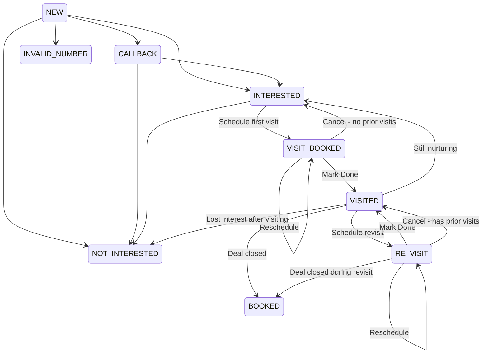

# VISITED Status + Visit History — Design Discussion

## Current Flow (Post-Implementation)

```
VISIT_BOOKED ──Mark Done──→ INTERESTED
VISIT_BOOKED ──Cancel─────→ INTERESTED
RE_VISIT     ──Mark Done──→ INTERESTED
RE_VISIT     ──Cancel─────→ INTERESTED
```

**Problem**: After a successful visit, the lead goes back to INTERESTED — the same status as a lead who's never visited. There's no visible distinction between "interested but never came" and "already visited the site."

---

## Proposal: Add `VISITED` Status

### Where it fits

```
NEW → CALLBACK → INTERESTED → VISIT_BOOKED → VISITED → BOOKED
                                                  ↘ RE_VISIT → VISITED → BOOKED
```

VISITED becomes a **stable pipeline state** — not transient like VISIT_BOOKED. It means "this person has physically been to the site at least once."

### Why it matters

| Without VISITED | With VISITED |
|---|---|
| After visit, lead blends into INTERESTED pool | Clear signal: "visited, further along in pipeline" |
| Can't easily count "how many visited this month?" | Trivial dashboard metric |
| Agent can't tell at a glance who's visited | Lead List shows "Visited" chip |
| RE_VISIT cancellations lose context | Cancel → VISITED preserves visit history |

### Color Suggestion

Teal (`#0d9488`) — distinct from INTERESTED green (`#10b981`), VISIT_BOOKED cyan (`#06b6d4`), and BOOKED dark green (`#16a34a`).

---

## Revised State Machine



### Key Transitions

| From | To | Trigger |
|---|---|---|
| VISIT_BOOKED | **VISITED** | Mark Done (first visit) |
| VISIT_BOOKED | INTERESTED | Cancel (no prior visits — back to pipeline) |
| VISIT_BOOKED | VISIT_BOOKED | Reschedule |
| RE_VISIT | **VISITED** | Mark Done (revisit) |
| RE_VISIT | **VISITED** | Cancel (has prior visits — stay in VISITED) |
| RE_VISIT | RE_VISIT | Reschedule |
| VISITED | RE_VISIT | Schedule another visit |
| VISITED | BOOKED | Deal closed |
| VISITED | NOT_INTERESTED | Lost interest after visiting |
| VISITED | INTERESTED | Manual — back to nurturing |

### Cancel Logic

How to decide whether cancel goes to INTERESTED or VISITED:

- **If `visit_history.length === 0`** (first visit cancelled) → INTERESTED
- **If `visit_history.length > 0`** (revisit cancelled, but they've visited before) → VISITED

The agent can always manually change status afterward if this guess is wrong.

---

## Visit History Tracking

### Data Model

New field on the [`ILead`](backend/src/models/Lead.ts:3) interface:

```typescript
visit_history?: Array<{
  scheduled_at: Date;
  completed_at?: Date;        // null if cancelled/no_show
  outcome: 'completed' | 'cancelled' | 'no_show';
  cancellation_reason?: string;
  notes?: string;
  created_at: Date;
}>;
```

Plus a denormalized counter for fast queries:

```typescript
visit_count?: number;  // incremented on each completed visit
```

### When entries get written

| Action | Entry |
|---|---|
| Mark Done | `{ outcome: 'completed', completed_at: now }` |
| Cancel Visit | `{ outcome: 'cancelled', cancellation_reason: 'client_busy' }` |
| (Future) No Show | `{ outcome: 'no_show' }` |

The entry is created at the time of scheduling (with `scheduled_at` set) and updated when the outcome is determined. Or alternatively, created fresh at outcome time with both dates.

**Recommendation**: Create the entry at outcome time (simpler). The `scheduled_at` is just a copy of what was in `site_visit_at` at that moment.

---

## Where to Show Visit History

### Option A: New "Visits" Tab (recommended)

Add a third tab alongside "Actions" and "History":

```
[Actions]  [History]  [Visits]
```

The Visits tab shows a timeline:

```
📋 Visit History (3 visits)

┌──────────────────────────────────────────┐
│ ✅ May 28, 2026 — Completed              │
│    Scheduled: May 28, 2026 at 11:00 AM  │
│    Re-visit for 3BHK discussion          │
├──────────────────────────────────────────┤
│ ✅ May 15, 2026 — Completed              │
│    Scheduled: May 15, 2026 at 2:00 PM   │
│    First site visit                      │
├──────────────────────────────────────────┤
│ ❌ May 02, 2026 — Cancelled              │
│    Reason: client_busy                   │
└──────────────────────────────────────────┘
```

### Option B: Card Below Info Card

A compact card between the info section and the tabs:

```
┌──────────────────────────────────────────┐
│ 📋 Visit History                    (3)  │
│ ✅ May 28  ·  ✅ May 15  ·  ❌ May 02   │
│              [View All]                  │
└──────────────────────────────────────────┘
```

### Option C: Integrated Into Activity History

Visits appear as styled entries in the existing History tab. Simpler to implement but less structured.

**Recommendation**: Option A (new tab) for clarity and future extensibility.

---

## Lead List Card Updates

With VISITED status:

```
┌──────────────────────────────────┐
│ Rajesh Kumar    📱 9876543210    │
│ Meta · Facebook Leads            │
│ [2BHK] [80L]  🔵 Visited (2)    │ ← VISITED chip + visit count
│ VISIT_BOOKED · May 28            │ ← (unchanged for visit statuses)
└──────────────────────────────────┘
```

The chip shows "Visited (2)" with the count in parentheses.

---

## Dashboard Impact

The pipeline section gains a VISITED column:

```
Pipeline
┌──────────┬────────────┬──────────┬──────────┬─────────┬──────────┬──────┐
│ Callback │ Interested │ Visit    │ Visited  │ Re-visit│ Booked   │ Not  │
│    12    │     8      │ Booked 3 │    5     │    2    │    1     │ Int. │
│          │            │          │          │         │          │  4   │
└──────────┴────────────┴──────────┴──────────┴─────────┴──────────┴──────┘
```

And "Today's Visits" metric remains unchanged (counts VISIT_BOOKED + RE_VISIT scheduled for today).

A new metric could be added later: "Total Visited (MTD)" — count of leads who entered VISITED status this month.

---

## Implementation Scope

| Priority | Task | Complexity |
|----------|------|------------|
| **P1** | Add `VISITED` to status enums (frontend types + backend model) | Low |
| **P1** | Update `handleMarkVisitDone()` to set status → VISITED | Low |
| **P1** | Update cancel logic: VISIT_BOOKED → INTERESTED, RE_VISIT → VISITED | Low |
| **P1** | Add `visit_history[]` + `visit_count` to Lead model | Medium |
| **P1** | Write visit_history entry on Mark Done / Cancel | Medium |
| **P2** | Add "Visits" tab to LeadDetailScreen with timeline UI | Medium |
| **P2** | VISITED chip + visit count on LeadListScreen cards | Low |
| **P2** | VISITED in Dashboard pipeline section | Low |
| **P2** | getStatusMeta color for VISITED (teal) | Low |
| **P3** | "Total Visited This Month" dashboard metric | Low |

---

## Files That Would Change

| File | Change |
|---|---|
| [`types/index.ts`](frontend/src/types/index.ts:11) | Add `'VISITED'` to Lead.status union |
| [`Lead.ts`](backend/src/models/Lead.ts) | Add `VISITED` to status enum, add `visit_history[]` and `visit_count` |
| [`leadController.ts`](backend/src/controllers/leadController.ts) | Handle `visit_history` push on status change to VISITED |
| [`LeadDetailScreen.tsx`](frontend/src/screens/LeadDetailScreen.tsx) | Updated handlers, new Visits tab, cancel logic based on visit_history length |
| [`LeadListScreen.tsx`](frontend/src/screens/LeadListScreen.tsx) | VISITED chip, filter chip |
| [`DashboardScreen.tsx`](frontend/src/screens/DashboardScreen.tsx) | Pipeline section with VISITED column |
| [`lead-status-architecture.md`](plans/lead-status-architecture.md) | Update status architecture docs |