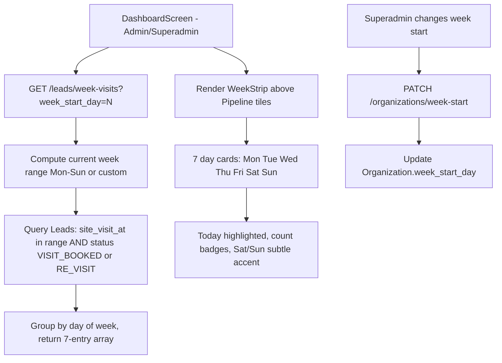

# Week Visit Strip — Dashboard Feature Plan

## Goal
Show a "This Week" calendar strip on the dashboard displaying how many visits (VISIT_BOOKED + RE_VISIT) are scheduled for each day of the current week. Placed prominently above the Pipeline Status section, visible to admin and superadmin only. Superadmin can configure which day the week starts (default: Monday).

## Architecture



## Backend Changes

### 1. Organization Model — `backend/src/models/Organization.ts`
Add new field:
```typescript
week_start_day: { type: Number, default: 1 }  // 0=Sunday, 1=Monday, ..., 6=Saturday
```

### 2. New Controller — `backend/src/controllers/leadController.ts`
Export `getWeekVisits`:
```typescript
export const getWeekVisits = async (req: AuthRequest, res: Response) => {
  // 1. Read week_start_day from query OR from org config (default 1 = Monday)
  // 2. Compute: find the most recent occurrence of week_start_day, then 7 days forward
  // 3. Aggregate:
  //    - $match: organization_id, status in [VISIT_BOOKED, RE_VISIT], site_visit_at in [weekStart, weekEnd]
  //    - $group by $dayOfWeek of site_visit_at, count
  // 4. Normalize MongoDB day numbers (1=Sunday) to the Mon-based 0-6 index
  // 5. Return array: [{label:"Mon", day_date:"2026-05-25", full_date:"25 May", count:3, is_today:false}, ...]
};
```

**Day mapping normalization:**
MongoDB `$dayOfWeek`: 1=Sun, 2=Mon, 3=Tue, 4=Wed, 5=Thu, 6=Fri, 7=Sat
Given `week_start_day=1` (Monday): Monday=day 0, Sunday=day 6
Formula: `index = (mongoDay - (week_start_day + 1) + 7) % 7`

### 3. Route — `backend/src/routes/leadRoutes.ts`
Add: `router.get('/week-visits', getWeekVisits);`

### 4. New Controller — `backend/src/controllers/userController.ts` (or organization endpoint)
Add `updateWeekStart` for superadmin to change:
```typescript
PATCH /organizations/week-start  { week_start_day: 0 }
// Only superadmin can update
```

## Frontend Changes

### 1. `DashboardScreen.tsx` — Add WeekStrip component

**State:**
```typescript
const [weekVisits, setWeekVisits] = useState<WeekDay[]>([]);
const [weekStartDay, setWeekStartDay] = useState(1); // Monday
```

**WeekStrip UI (between stat cards and pipeline):**

**Header row:** "This Week" label on the left, total visit count badge in the center (e.g., "22 visits"), and the superadmin week-start picker on the right.
```
┌──────────────────────────────────────────────────┐
│  This Week         22 visits        [Mon ▼]      │  ← superadmin sees dropdown
│  ┌────┬────┬────┬────┬────┬────┬────┐            │
│  │MON │TUE │WED │THU │FRI │SAT*│SUN*│            │
│  │ 26 │ 27 │ 28 │ 29 │ 30 │ 31 │  1 │            │
│  │  5 │  2 │  0 │  3 │  1 │  7 │  4 │            │  ← counts in colored bubbles
│  └────┴────┴────┴────┴────┴────┴────┘            │
│  * Sa/Su subtly tinted amber/gold                │
└──────────────────────────────────────────────────┘
```

**Day card design:**
- 7 equal-width columns in a horizontal row
- Each card: rounded rect with subtle background
- Day abbreviation (MON) in small text at top
- Date number (26) in medium bold
- Count in a colored circle/badge (primary if >0, muted gray if 0)
- Today's card: primary background, white text
- Saturday/Sunday: subtle amber/gold left border or background tint

**Week start selector (superadmin only):**
- Dropdown/picker next to "This Week" title
- Options: Monday, Tuesday, Wednesday, Thursday, Friday, Saturday, Sunday (all 7 days)
- Default: Monday
- On change: update org setting via API, refetch week-visits
- Day labels in the strip header row reorder accordingly (e.g., if Friday is picked: Fri, Sat, Sun, Mon, Tue, Wed, Thu)

### 2. Fetch data in `fetchData` callback
Add parallel fetch for `client.get('/leads/week-visits', { params: { week_start_day: weekStartDay } })` — only for admin/superadmin.

### 3. API client type
Add `WeekDay` interface to `frontend/src/types/index.ts`:
```typescript
export interface WeekDay {
  label: string;        // "Mon", "Tue", ...
  day_date: string;     // "2026-05-26"
  full_date: string;    // "26 May"
  count: number;
  is_today: boolean;
}
```

## Superadmin Week Start Toggle — Design Decision

**Option A: Inline on dashboard** — a dropdown next to "This Week" title. Pros: immediate feedback, no navigation. Cons: clutters dashboard.

**Option B: Organization settings screen** — a separate settings area. Pros: cleaner dashboard. Cons: extra navigation.

**Recommendation: Option A** — simple inline `<Picker>` or dropdown next to the "This Week" heading, only rendered when `user?.role === 'superadmin'`. All 7 days as options: Monday, Tuesday, Wednesday, Thursday, Friday, Saturday, Sunday (default: Monday). Day labels in the strip reorder dynamically based on selection. Changes immediately refetch the week data and PATCH the org setting.

## Execution Order

1. Add `week_start_day` to Organization model + interface
2. Create `getWeekVisits` controller in leadController.ts
3. Add route `GET /leads/week-visits` in leadRoutes.ts
4. Create `updateWeekStart` in userController.ts or a new org controller
5. Add `WeekDay` type to frontend types
6. Build WeekStrip inline component + styles in DashboardScreen
7. Wire fetch + state + conditional rendering for managers
8. Add superadmin week-start picker
9. Rebuild backend, test with npx tsc